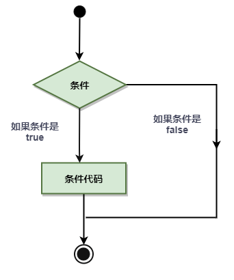
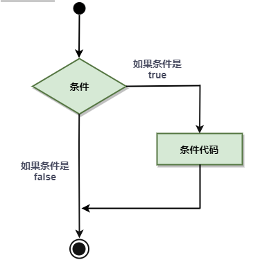
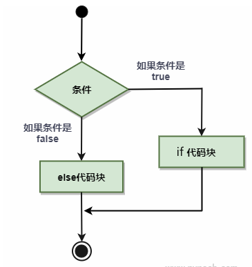
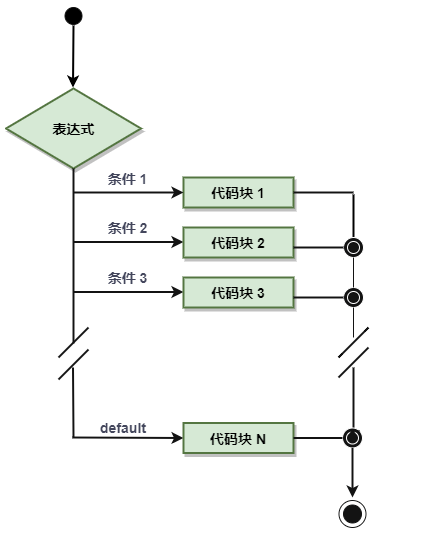
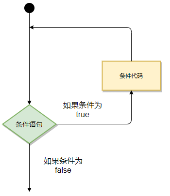

# 条件和循环

在程序中必然少不了条件语句和循环语句，Go 语言在条件、循环语句方面与其他语言存在一定的差异，本文将针对 Go 语言中条件语句、循环语句的使用，这将会奠定后续复杂程序的基础。

## 1、条件语句

条件语句需要开发者通过指定一个或多个条件，并通过测试条件是否为 `true` 来决定是否执行指定语句，并在条件为 `false` 的情况在执行另外的语句。

下图展示了程序语言中条件语句的结构：



Go 语言提供了以下几种条件判断语句：

| 语句                                     | 描述                                                         |
| ---------------------------------------- | ------------------------------------------------------------ |
| `if` 语句 | **if 语句** 由一个布尔表达式后紧跟一个或多个语句组成。       |
| `if...else` 语句 | **if 语句** 后可以使用可选的 `else` 语句, `else` 语句中的表达式在布尔表达式为 false 时执行。 |
| `if` 嵌套语句 | 你可以在 **if** 或 **else if** 语句中嵌入一个或多个 **if** 或 **else if** 语句。 |
| `switch` 语句 | **switch** 语句用于基于不同条件执行不同动作。                |
| `select` 语句 | **select** 语句类似于 **switch** 语句，但是 `select` 会随机执行一个可运行的 `case`。如果没有 `case` 可运行，它将阻塞，直到有 `case` 可运行。 |

<font color="red">**注意：Go 没有三目运算符，所以不支持 `? :` 形式的条件判断。**</font>

### 1.1 if 语句

**语法**

Go 编程语言中 `if` 语句的语法如下：

```go
if 布尔表达式 {
   // 在布尔表达式为 true 时执行
}
```

`if` 在布尔表达式为 true 时，其后紧跟的语句块执行，如果为 false 则不执行。

> 布尔表达式可以不用 `()` 括起来，简洁了很多。

流程图如下：



**示例**

使用 `if` 判断一个整数的大小，示例如下：

```go
package main

import "fmt"

func main() {
	var a int = 10

	if a < 20 {
		fmt.Printf("a 小于 20\n")
	}
}
```

输出结果如下：

```sh
a 小于 20

```

### 1.2 if .. else 语句

**语法**

Go 编程语言中 `if...else` 语句的语法如下：

```go
if 布尔表达式 {
   // 在布尔表达式为 true 时执行
} else {
  // 在布尔表达式为 false 时执行
}
```

`if` 在布尔表达式为 true 时，其后紧跟的语句块执行，如果为 false 则执行 else 语句块。

流程图如下：



**示例**

使用 `if else` 判断一个整数的大小，示例如下：

```go
package main

import "fmt"

func main() {
	var a int = 30

	if a < 20 {
		fmt.Printf("a 小于 20\n")
	} else {
		fmt.Printf("a 大于 20\n")
	}
}
```

输出结果如下：

```sh
a 大于 20

```

### 1.3 if 嵌套语句

**语法**

Go 编程语言中 `if...else` 语句的语法如下：

```go
if 布尔表达式 1 {
   // 在布尔表达式 1 为 true 时执行
   if 布尔表达式 2 {
      // 在布尔表达式 2 为 true 时执行
   }
}
```

此外，也可以在if中嵌套 `if..else` 语句等条件语句。

**示例**

```go
package main

import "fmt"

func main() {
	var a int = 30
	var b int = 100

	if a == 30 {
		if b == 100 {
			fmt.Printf("a = %d, b = %d\n", a, b)
		}
	}
}
```

输出结果如下：

```sh
a = 30, b = 100

```

### 1.4 switch 语句

`switch` 语句用于基于不同条件执行不同动作，每一个 `case` 分支都是唯一的，从上至下，直到匹配为止。

和其它语言不同的是：

* `switch` 语句执行的过程从上至下，直到找到匹配项，**匹配项后面也不需要再加 `break`**。

* `switch` 默认情况下 `case` 最后自带 `break` 语句，匹配成功后就不会执行其他 `case`，如果我们需要执行后面的 `case`，可以使用  `fallthrough` 。

* `switch` 后面变量的类型可以是任何类型，不再局限于常量或整数。

**语法**

Go 编程语言中 `switch` 语句的语法如下：

```go
switch var1 {
    case val1:
        ...
    case val2:
        ...
    default:
        ...
}
```

变量 `var1` 可以是任何类型，而 `val1` 和 `val2` 则可以是同类型的任意值。类型不被局限于常量或整数，但必须是相同的类型；或者最终结果为相同类型的表达式。

您可以同时测试多个可能符合条件的值，使用逗号分割它们，例如：`case val1, val2, val3`。

流程图如下：



**示例**

```go
package main

import "fmt"

func main() {
	var grade string = "B"
	var marks int = 90

	switch marks {
	case 90:
		grade = "A"
	case 80:
		grade = "B"
	case 50, 60, 70:
		grade = "C"
	default:
		grade = "D"
	}

	switch {
	case grade == "A":
		fmt.Printf("优秀!\n")
	case grade == "B", grade == "C":
		fmt.Printf("良好\n")
	case grade == "D":
		fmt.Printf("及格\n")
	case grade == "F":
		fmt.Printf("不及格\n")
	default:
		fmt.Printf("差\n")
	}
	fmt.Printf("你的等级是 %s\n", grade)
}
```

输出结果如下：

```sh
优秀!
你的等级是 A

```

### 1.5 select 语句

## 2、循环语句

在不少实际问题中有许多具有规律性的重复操作，因此在程序中就需要重复执行某些语句。

以下为大多编程语言循环程序的流程图：



**与多数语言不同的是，Go语言中的循环语句只支持 `for` 关键字，而不支持 `while` 和 `do-while` 结构。**

Go 语言提供了以下几种类型循环语句：

| 循环类型                                | 描述                                                         |
| :-------------------------------------- | :----------------------------------------------------------- |
| `for` 循环 | 重复执行相同逻辑的语句块。`for` 循环中也可以嵌套一个或多个 `for` 循环。在实际开发中，嵌套层数不要太深，一般 2 层即可。 |
| `for range` 循环 | 能够帮助我们快速遍历数组、切片、哈希表以及 `Channel` 等集合类型。 |

在循环过程中，因实际需求需要在适当的条件下推出循环，此时循环控制语句则可以控制循环体内语句的执行过程。

Go 语言支持以下几种循环控制语句：

| 控制语句                            | 描述                                             |
| :---------------------------------- | :----------------------------------------------- |
| `break` 语句 | 经常用于中断当前 `for` 循环或跳出 `switch` 语句      |
| `continue` 语句 | 跳过当前循环的剩余语句，然后继续进行下一轮循环。 |
| `goto` 语句 | 将控制转移到被标记的语句。                       |

### 2.1 for 循环

**语法**

Go 语言 `for` 循环更加的灵活，有三种形式：

```go
for init; condition; post {
	// 循环体
}
```

类似于 `do while`：

```go
for condition {
	// 循环体
}
```

无限循环：

```go
for {
	// 循环体
}
```

* `init`： 一般为赋值表达式，给控制变量赋初值。
* `condition`： 关系表达式或逻辑表达式，循环控制条件。
* `post`： 一般为赋值表达式，给控制变量增量或减量。

**示例**

求 1~100 之间的求和，示例如下：

```go
package main

import "fmt"

func main() {
	sum := 0
	for i := 1; i <= 100; i++ {
		sum += i
	}
	fmt.Println(sum)
}
```

### 2.2 for range 循环

除了使用经典的三段式循环之外，Go 语言还引入了一个新的关键字 `range`，用于帮助我们快速遍历数组等集合类型，非常简洁好用，成为了数组遍历的标配。

**语法**

```go
for k,v := range arr {
	// 循环体
}
```

* `k`：数组 `arr` 的索引。
* `v`：数组 `arr` 对应索引 `k` 的值。

**示例**

循环输出一个数组中的所有数据，示例如下：

```go
package main

import "fmt"

func main() {
	arr := []string{"A", "B", "C", "D"}
	for k, v := range arr {
		fmt.Printf("arr[%d]=%s\n", k, v)
	}
}
```

输出结果如下：

```
arr[0]=A
arr[1]=B
arr[2]=C
arr[3]=D
```

### 2.3 break 语句

Go 语言中 `break` 语句用于以下三方面：

* 用于循环语句中跳出循环，并开始执行循环之后的语句。
* `break` 在 `switch` 中在执行一条 `case` 后跳出语句的作用。
* 在多重循环中，可以用标号 `label` 标出想 `break` 的循环。

**语法**

```go
break
```

**示例**

示例如下：

```go
package main

import "fmt"

func main() {
	var a int = 10
	for a < 20 {
		fmt.Printf("a=%d\n", a)
		a++

		if a > 15 {
			break
		}
	}

}
```

输出结果如下：

```sh
a=10
a=11
a=12
a=13
a=14
a=15
```

使用多重循环，演示使用标记和不使用标记的区别，示例2如下：

```go
package main

import "fmt"

func main() {

    // 不使用标记
    fmt.Println("---- break ----")
    for i := 1; i <= 3; i++ {
        fmt.Printf("i: %d\n", i)
                for i2 := 11; i2 <= 13; i2++ {
                        fmt.Printf("i2: %d\n", i2)
                        break
                }
        }

    // 使用标记
    fmt.Println("---- break label ----")
    re:
        for i := 1; i <= 3; i++ {
            fmt.Printf("i: %d\n", i)
            for i2 := 11; i2 <= 13; i2++ {
                fmt.Printf("i2: %d\n", i2)
                break re
            }
        }
}
```

输出结果如下：

```sh
---- break ----
i: 1
i2: 11
i: 2
i2: 11
i: 3
i2: 11
---- break label ----
i: 1
i2: 11   
```

### 2.4 continue 语句

Go 语言的 `continue` 语句 有点像 [`break` 语句](#2.3 break 语句)。但是 `continue` 不是跳出循环，而是跳过当前循环执行下一次循环语句。

**语法**

```go
continue
```

**示例**

示例如下：

```go
package main

import "fmt"

func main() {
	var a int = 10
	for a < 20 {
		fmt.Printf("a=%d\n", a)
		a++

		if a > 15 {
			continue
		}
        fmt.Printf("****\n")
	}
}

```

输出结果如下：

```sh
a=10
****
a=11
****
a=12
****
a=13
****
a=14
****
a=15
a=16
a=17
a=18
a=19
```

### 2.5 goto 语句

Go 语言的 `goto` 语句可以无条件地跳转到任意指定位置。

`goto` 语句通常与条件语句配合使用。可用来实现条件转移， 构成循环，跳出循环体等功能。

但是，在结构化程序设计中一般不主张使用 `goto` 语句， 以免造成程序流程的混乱，使理解和调试程序都产生困难。（这与 Java 语言中一样，不推荐使用。）

**语法**

```go
goto label
..
.
label: statement
```

**示例**

示例如下：

```go
package main

import "fmt"

func main() {
	var b int = 10
	for b < 20 {
		fmt.Printf("b=%d\n", b)
		b++

		if b > 15 {
			goto print
		}

	}

print:
	fmt.Printf("****\n")

}
```

输出结果如下：

```sh
b=10
b=11
b=12
b=13
b=14
b=15
****
```