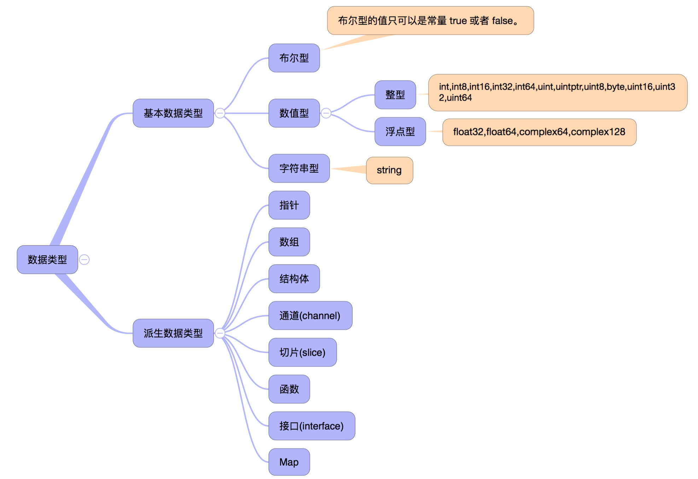

# 数据类型

Go 语言是一种静态类型的编程语言，在 Go 编程语言中，数据类型用于声明函数和变量。数据类型的出现是为了把数据分成所需内存大小不同的数据，编程的时候需要用大数据的时候才需要申请大内存，就可以充分利用内存。编译器在进行编译的时候，就要知道每个值的类型，这样编译器就知道要为这个值分配多少内存，并且知道这段分配的内存表示什么。

Go 语言按类别有以下几种数据类型：



下面将针对各种数据类型的使用展开详细的说明。

## 1、基本数据类型

### 1.1 布尔型

布尔类型的值只有两种：`true` 或 `false`。在`if` 和 `for` 语句的条件部分都是布尔类型的值，并且 `==` 和 `<` 等比较操作也会产生布尔型的值。

一元操作符 `!` 对应逻辑非操作，因此 `!true` 的值为 `false`，更复杂一些的写法是 `(!true==false) == true`，实际开发中我们应尽量采用比较简洁的布尔表达式，就像用 x 来表示 `x==true`。

```go
var a = 10
fmt.Println(a == 10)	// true
fmt.Println(a == 5)		// false
fmt.Println(a != 10)	// false
fmt.Println(a != 5)		// true
```

Go 语言对于值之间的比较有非常严格的限制，只有两个相同类型的值才可以进行比较，如果值的类型是接口（`interface`），那么它们也必须都实现了相同的接口。如果其中一个值是常量，那么另外一个值可以不是常量，但是类型必须和该常量类型相同。如果以上条件都不满足，则必须将其中一个值的类型转换为和另外一个值的类型相同之后才可以进行比较。

```go
var a = 10
fmt.Println(a == true)	// cannot use true (type untyped bool) as type int
```

布尔值可以和 `&&`（`AND`）和 `||`（`OR`）操作符结合，并且有短路行为，如果运算符左边的值已经可以确定整个布尔表达式的值，那么运算符右边的值将不再被求值，因此下面的表达式总是安全的：

```go
s != "" && s[0] == 'x'
```

Go 语言中不允许将整型强制转换为布尔型，代码如下：

```go
var n bool
fmt.Println(int(n) * 2)		// cannot convert n (type bool) to type int
```

### 1.2 数值型

Go 语言的数值类型分为以下几种：整数、浮点数、复数。其中每一种都包含了不同大小的数值类型，例如有符号整数包含 `int8`、`int16`、`int32`、`int64` 等，每种数值类型都决定了对应的大小范围和是否支持正负符号。本小节我们主要介绍一下数值类型。

#### 1.2.1 整型

Go 语言也是基于架构的类型，同时提供了有符号和无符号的整数类型，具体如下：

| 类型  | 字节 | 描述 | 数据范围 |
| ----- | ---- | -------- | ----- |
| `uint8` | 1 | 无符号8位整型 |  0 ~ 255（2<sup>8</sup>-1）  |
| `uint16` | 2 | 无符号16位整型 | 0 ~ 65535（2<sup>16</sup>-1） |
| `uint32` | 4 | 无符号32位整型 | 0 ~ 2<sup>32</sup>-1 |
| `uint64` | 8 | 无符号64位整型 | 0 ~ 2<sup>64</sup>-1 |
| `int8` | 1 | 有符号8位整型 | -128（2<sup>-7</sup>-1） ~ 127（2<sup>7</sup>-1） |
| `int16` | 2 | 有符号16位整型 | -32768（2<sup>-15</sup>-1） ~ 65535（2<sup>15</sup>-1） |
| `int32` | 4 | 有符号32位整型 | 2<sup>-31</sup>-1 ~ 2<sup>31</sup>-1 |
| `int64` | 8 | 有符号64位整型 | 2<sup>-63</sup>-1 ~ 2<sup>63</sup>-1 |
| `int` | 4或8 | 有符号32或64位整型 | 取决于编译器和计算机硬件 |
| `uint` | 4或8 | 无符号32或64位整型 | 取决于编译器和计算机硬件 |
| `uintptr` | 4或8 | 用于存放一个指针 | 取决于编译器和计算机硬件 |

> 有符号：用最高位表示符号（正或负），其余位表示数值大小。
>
> 无符号：所有位都用于表示数的大小。
>
> 1 字节 = 8 位

大多数情况下，我们只需要 `int` 一种整型即可，它可以用于循环计数器（for 循环中控制循环次数的变量）、数组和切片的索引，以及任何通用目的的整型运算符，通常 `int` 类型的处理速度也是最快的。

#### 1.2.2 浮点型

Go 语言提供了两种精度的浮点数：`float32` 和 `float64`，这些浮点数类型的取值范围可以从很微小到很巨大。

| 类型      | 描述         | 数据范围                                               |
| --------- | ------------ | ------------------------------------------------------ |
| `float32` | 32位浮点型数 | 最大值：3.40282346638528859811704183484516925440e+38   |
| `float64` | 64位浮点型数 | 最大值：1.797693134862315708145274237317043567981e+308 |

很小或很大的数最好用科学计数法书写，通过 e 或 E 来指定指数部分：

```go
const Avogadro = 6.02214129e23	// 阿伏伽德罗常数
const Planck   = 6.62606957e-34 // 普朗克常数
```

#### 1.2.3 复数

复数是由两个浮点数表示的，其中一个表示实部（`real`），一个表示虚部（`imag`）。

Go 语言中复数的类型有两种，分别是 `complex128`（64 位实数和虚数）和 `complex64`（32 位实数和虚数），其中 `complex128` 为复数的默认类型。

复数的值由三部分组成 RE + IMi，其中 RE 是实数部分，IM 是虚数部分，RE 和 IM 均为 float 类型，而最后的 i 是虚数单位。如：`1+2i`

声明复数的语法格式如下所示：

```go
var name complex128 = complex(x, y)
```

其中 `name` 为复数的变量名，`complex128` 为复数的类型，“=” 后面的 `complex` 为Go语言的内置函数用于为复数赋值，x、y 分别表示构成该复数的两个 `float64` 类型的数值，x 为实部，y 为虚部。

如下所示：

```go
var cmp complex128 = complex(1, 2)	// 复数：1+2i
fmt.Println(real(cmp)) 	// 输出实部 1
fmt.Println(imag(cmp)) 	// 输出虚部 2
```

### 1.3 字符串型

字符串是一种值类型，且值不可变，即创建某个文本后将无法再次修改这个文本的内容，其实，字符串是字节的定长数组。	

使用双引号 `""` 来定义字符串，字符串中可以使用转义字符来实现换行、缩进等效果，常用的转义字符包括：

- `\n`：换行符
- `\r`：回车符
- `\t`：tab 键
- \u `或` \U`：Unicode 字符
- `\\`：反斜杠自身

Go 语言比其他语言更加的灵活，此外，可通过反引号 `` ` `` 可以定义多行字符串。（注意：是反引号 `` ` ``（键盘上1键左边键），而不是引号 `‘`）

多行字符串一般用于内嵌源码和内嵌数据等。

示例如下：

```go
package main

import "fmt"

func main() {
	// 字符串
	var str = "兄弟们！\n赶紧开始学习Go语言啦。"
	fmt.Println(str)
    var str2 = `第一行
	第二行
	第三行
	`
	fmt.Println(str2)
}
```

输出结果如下：

```go
兄弟们！
赶紧开始学习Go语言啦。
第一行
        第二行
        第三行

```

## 2、派生数据类型

### 2.1 指针

与 Java 等编程语言不同，Go 语言为程序员提供了控制数据结构指针的能力，但是，并不能进行指针运算。Go语言允许你控制特定集合的数据结构、分配的数量以及内存访问模式，这对于构建运行良好的系统是非常重要的。指针对于性能的影响不言而喻，如果你想要做系统编程、操作系统或者网络应用，指针更是不可或缺的一部分。

**一个指针变量指向了一个值的内存地址。**

类似于变量和常量，在使用指针前你需要声明指针。指针声明格式如下：

```go
var <变量名> *<变量类型>
```

例如：

```go
var ip *int		// 指向整型的指针
```

指针的使用流程一般为：

* 定义指针变量。
* 为指针变量赋值。
* 访问指针变量中指向地址的值。

示例如下：

```go
package main

import "fmt"

func main() {
	// 指针
	var i int = 20 // 声明实际变量
	var ip *int    // 声明指针变量
	ip = &i        // 指针变量的存储地址
	fmt.Println("i变量的地址是: ", &i)	// 变量的存储地址
	fmt.Println("ip变量储存的指针地址: ", ip) // 指针变量的存储地址
	fmt.Println("*ip变量的值: ", *ip)    // 使用指针访问值
}
```

输出结果如下：

```go
i变量的地址是:  0xc00008a000
ip变量储存的指针地址:  0xc00008a000
*ip变量的值:  20
```

提示：变量、指针和地址三者的关系是，每个变量都拥有地址，指针的值就是地址。

### 2.2 数组

数组是具有相同类型的一组已编号且长度固定的数据集合，这种类型可以是任意的基本数据类型，例如整型、字符串，或者自定义类型。

相对于去声明 `number0`, `number1`, ..., `number99` 的变量，使用数组形式 `numbers[0]`, `numbers[1]` ..., `numbers[99]` 更加方便且易于扩展。

数组元素可以通过索引（位置）来读取（或者修改），索引从 0 开始，第一个元素索引为 0，第二个索引为 1，以此类推。

**声明数组**

Go 语言数组声明需要指定元素类型及元素个数，语法格式如下：

```go
var <数组变量名> [数组长度]<数组变量类型>
```

例如，定义一个长度为 5 的 int 类型数组：

```go
var intArr [5]int
```

**初始化数组**

```go
var intArr = [5]int{1,2,3,4,5}
```

或者

```go
intArr := [5]int{1,2,3,4,5}
```

如果数组长度不确定，可以使用 `...` 代替数组的长度，编译器会根据元素个数自行推断数组的长度：

```go
intArr := [...]int{1,2,3,4,5}
```

如果设置了数组的长度，我们还可以通过指定下标来初始化对应元素：

```go
// 将索引为1和3的元素初始化,其他索引的元素将以默认值处理
intArr := [5]int{1:2,3:5}
```

**访问数组元素**

数组元素可以通过索引来读取。格式为数组名后加中括号 `[]`，中括号中为索引的值。例如：

```go
var i int = intArr[4]
```

示例如下：

```go
package main

import "fmt"

func main() {
	// 数组
	var intArr [10]int // 定义一个int类型数组
	var idx int
	// 遍历数组赋值
	for idx = 0; idx < 10; idx++ {
		intArr[idx] = idx * 10
	}
	for idx = 0; idx < 10; idx++ {
		fmt.Printf("intArr[%d] = %d\n", idx, intArr[idx])
	}
}
```

输出结果如下：

```go
intArr[0] = 0
intArr[1] = 10
intArr[2] = 20
intArr[3] = 30
intArr[4] = 40
intArr[5] = 50
intArr[6] = 60
intArr[7] = 70
intArr[8] = 80
intArr[9] = 90
```

### 2.3 结构体

Go 语言中数组只能存储同一类型的数据，但在结构体中我们可以为不同项定义不同的数据类型。

Go 语言中没有类的概念，因此在 Go 中结构体有着更为重要的地位。

结构体是由一系列具有相同类型或不同类型的数据构成的数据集合。

结构体表示一项记录，比如保存一个人的信息，每个人有以下属性：

* `Name` ：姓名
* `Sex`： 性别
* `Age`：年龄

**结构体定义**

结构体定义需要使用 `type` 和 `struct` 语句。`struct` 语句定义一个新的数据类型，结构体中有一个或多个成员。`type` 语句设定了结构体的名称。结构体的格式如下：

```go
type <结构体名称> struct {
    <成员名称1> <数据类型>
    <成员名称2> <数据类型>
    ……
    <成员名称n> <数据类型>
}
```

例如：

```go
type Person struct {
   Name string
   Sex string
   Age int
}
```

**结构体声明、赋值**

定义好一个结构体后，就可以声明结构体为一个变量，并自动初始化为零值，然后可以对其成员赋值，例如：

```go
var p Person
p.Name = "xcbeyond"
p.Age = 18
```

或者，使用结构体字面量声明变量，并初始化为非零值，例如：

```go
p := Person {
    Name: "xcbeyond",
    Sex: "F",
    Age: 18
}
```

### 2.4 通道(channel)

通道，是 `goroutine` 之间的通道。它可以让 `goroutine` 之间相互通信。（在后续并发章节会详细讲解）

每个通道都有与其相关的类型。该类型是通道允许传输的数据类型。

**声明通道**

和声明一个变量一样，语法如下：

```go
// 声明通道
var <通道名称> chan <数据类型>
// 创建通道：如果通道为nil(就是不存在)，就需要先创建通道
<通道名称> = make(chan <数据类型>)
```

也可以简化声明为：

```go
<通道名称> := make(chan <数据类型>)
```

示例如下：

```go
package main

import "fmt"

func main() {
	// 通道
	var c chan int
	if c == nil {
		fmt.Println("通道c是nil的, 不能使用，需要先创建通道。")
		c = make(chan int)
		fmt.Printf("c的数据类型是：%T", c)
	}
}
```

输出结果如下：

```go
通道c是nil的, 不能使用，需要先创建通道。
c的数据类型是：chan int
```

### 2.5 切片(slice)

Go 语言切片是对数组的抽象。

Go 数组的长度不可改变，在特定场景中这样的集合就不太适用，Go 中提供了一种灵活，功能强悍的内置类型切片("动态数组")，**与数组相比切片的长度是不固定的，可以追加元素，在追加时可能使切片的容量增大。**

**切片定义**

使用一个未指定大小的数组来定义切片：

```go
var <变量名> []<数据类型>
```

或使用 `make()` 函数创建切片：

```go
var <变量名> []<数据类型> = make([]<数据类型> len)
或
<变量名> := make([]<数据类型> len)
```

也可以指定容量，其中 capacity 为可选参数：

```go
make([]T, length, capacity)
```

这里的 length 是数组的长度也是切片的初始长度。

**切片初始化**

直接初始化切片，`[]` 表示是切片类型，`{1,2,3}` 初始化值依次是 `1,2,3`，其中 `cap=len=3`：

```sh
s :=[] int {1,2,3 } 
```

初始化切片 `s`，是数组 `arr` 的引用：

```go
s := arr[:] 
```

将 `arr` 中从下标 `startIndex` 到 `endIndex-1` 下的元素创建为一个新的切片：

```go
s := arr[startIndex:endIndex] 
```

默认 `startIndex` 时将表示一直到 `arr` 的最后一个元素：

```go
s := arr[startIndex:] 
```

默认 `endIndex` 时将表示从 `arr` 的第一个元素开始。

```go
s := arr[:endIndex] 
```

通过切片 `s` 初始化切片 `s1`。

```go
s1 := s[startIndex:endIndex] 
```

通过内置函数 `make()` 初始化切片 `s`，`[]int` 标识为其元素类型为 `int` 的切片：

```go
s :=make([]int,len,cap) 
```

### 2.6 函数

函数是基本的代码块，用于执行一个任务。

Go 语言最少有个 `main()` 函数。

你可以通过函数来划分不同功能，逻辑上每个函数执行的是指定的任务。

函数声明告诉了编译器函数的名称，返回类型，和参数。

Go 语言标准库提供了多种可动用的内置的函数。例如，`len()` 函数可以接受不同类型参数并返回该类型的长度。如果我们传入的是字符串则返回字符串的长度，如果传入的是数组，则返回数组中包含的元素个数。

**函数定义**

Go 语言函数定义格式如下：

```go
func function_name( <parameter list> ) <return_types> {
   函数体
}
```

* `func`：函数由 `func` 开始声明
* `function_name`：函数名称，函数名和参数列表一起构成了函数签名。
* `parameter list`：参数列表，参数就像一个占位符，当函数被调用时，你可以将值传递给参数，这个值被称为实际参数。参数列表指定的是参数类型、顺序、及参数个数。参数是可选的，也就是说函数也可以不包含参数。
* `return_types`：返回类型，函数返回一列值。`return_types` 是该列值的数据类型。有些功能不需要返回值，这种情况下 `return_types` 不是必须的。
* 函数体：函数定义的代码集合。

示例如下：

```go
package main

import "fmt"

func main() {
	fmt.Print(max(10, 7))
}

// 获取两数的最大值
func max(num1, num2 int) int {
	if num1 > num2 {
		return num1
	} else {
		return num2
	}
}
```

输出结果如下：

```sh
10
```

与其他语言不同的是，Go语言的函数可以返回多个值。

示例如下：

```go
package main

import "fmt"

func main() {
	x, y := swap("xcbeyond", "Niki")
	fmt.Println(x, y)
}

// 交换两个字符串
func swap(x, y string) (string, string) {
	return y, x
}
```

输出结果如下：

```sh
Niki xcbeyond
```

### 2.7 接口(interface)

Go 语言提供了另外一种数据类型即接口，它把所有的具有共性的方法定义在一起，任何其他类型只要实现了这些方法就是实现了这个接口。

### 2.8 Map

`Map` 是一种无序的键值对的集合。`Map` 最重要的一点是通过`key` 来快速检索数据，`key` 类似于索引，指向数据的值。

`Map` 是一种集合，所以我们可以像迭代数组和切片那样迭代它。不过，`Map` 是无序的，我们无法决定它的返回顺序，这是因为 `Map` 是使用 `hash` 表来实现的。

**Map定义**

可以使用内建函数 `make()` ，也可以使用 `map` 关键字来定义 `Map`：

```go
// 声明变量，默认map是nil
var map_variable map[key_data_type]value_data_type

// 使用make
map_variable := make(map[key_data_type]value_data_type)
```

示例如下：

```go
package main

import (
	"fmt"
)

func main() {
	// Map
	personMap := make(map[string]string)
	personMap["zhangsan"] = "张三"
	personMap["lisi"] = "李四"
	personMap["wanger"] = "王二"
	personMap["zhaowu"] = "赵五"
	for p := range personMap {
		fmt.Println(p, "的中文名是", personMap[p])
	}
}
```

输出结果如下：

```sh
zhangsan 的中文名是 张三
lisi 的中文名是 李四
wanger 的中文名是 王二
zhaowu 的中文名是 赵五
```

## 3、其他

### 3.1 数据类型转换

面对不同的数据类型，尤其是基本数据类型，在必要的情况下，一个类型的值是可以被转换为另外一个可被转换的类型。

不同于其他语言，Go 语言不存在隐式类型转换，所有的类型转换都必须是显示的转换：

```go
类型B的值 = 类型B(类型A的值)
```

类型转换只能在定义正确的情况下才能转换成功，例如从一个取值范围较小的类型转换到一个取值范围较大的类型（将 `int16` 转换为 `int32`）。当从一个取值范围较大的类型转换到取值范围较小的类型时（将 `int32` 转换为 `int16` 或将 `float32` 转换为 `int`），会发生精度丢失（截断）的情况。

换言之，**类型转换只能从低精度向高精度转换，否则将会存在精度丢失。**

示例如下：

```go
package main

import (
	"fmt"
)

func main() {
	// 类型转换
	var i16 int16 = 10000
	i32 := int32(i16)
	fmt.Print(i32)
}
```

### 3.2 类型别名

类型别名是 Go 1.9 版本添加的新功能，**主要用于解决代码升级、迁移中存在的类型兼容性问题。**在 C/C++ 语言中，代码重构升级可以使用宏快速定义一段新的代码，Go 语言中没有选择加入宏，而是解决了重构中最麻烦的类型名变更问题。

在 Go 1.9 版本之前定义内建类型的代码是这样写的：

```go
type byte uint8
type rune int32
```

而在 Go 1.9 版本之后变为：

```go
type byte = uint8
type rune = int32
```

**类型别名定义**

定义类型别名的写法为：

```go
type TypeAlias = Type
```

`TypeAlias` 只是 `Type` 的别名，本质上 `TypeAlias` 与 `Type` 是同一个类型，就像一个孩子小时候有小名、乳名，上学后用学名，英语老师又会给他起英文名，但这些名字都指的是他本人。

注意：类型别名与类型定义表面上只有一个等号的差异，那么它们之间实际的区别有哪些呢？通过下面的示例代码来理解。

示例如下：

```go
package main

import "fmt"

// 定义int类型的变量为NewInt
type NewInt int

// 定义int类型的别名IntAlias
type IntAlias = int

func main() {
	var a NewInt
	fmt.Printf("a type:%T\n", a)

	var a2 IntAlias
	fmt.Printf("a2 type:%T\n", a2)
}
```

输出结果如下：

```sh
a type:main.NewInt
a2 type:int
```

## 4、小结

本文主要讲解 Go 语言中存在哪些数据类型，让你对所有数据类型有个整体的认识，学会对它们的基本使用（定义、初始化等）。从上面的学习中，你会发现 Go 语言相比其他语言是更加的灵活，弥补了其他语言数据类型的一些缺失、不便等。