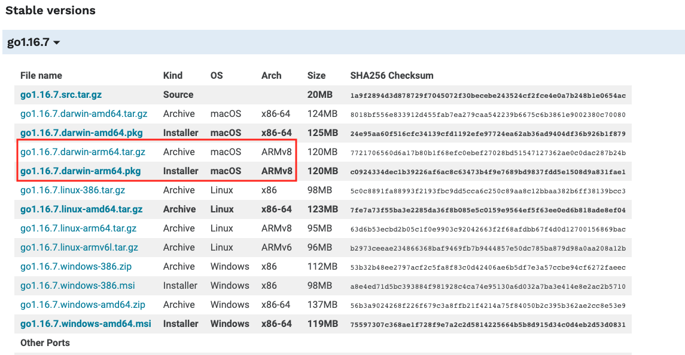

# MacOS M1上VSCode Debug Go程序失败

> [VSCode](https://code.visualstudio.com/) 是一款由微软开发且跨平台的免费源代码编辑器。该软件支持语法高亮、代码自动补全、代码重构、查看定义功能，并且内置了命令行工具和 Git 版本控制系统。用户可以更改主题和键盘快捷方式实现个性化设置，也可以通过内置的扩展程序商店安装扩展以拓展软件功能。
>
> VSCode 目前已经被广大开发者作为首选工具，其丰富的插件，可谓是一个工具，干尽所有事，比如：可以作为 Java、Go、Python等语言的IDE，也可以用于Markdown、draw.io等的编辑等等。

本文将针对在 [MacOS M1](https://zh.wikipedia.org/wiki/Apple_M1) 芯片的电脑上，使用 VSCode 来 Debug Golang 程序时，遇到的问题进行总结，并给出解决方案。

## 1、问题描述

在 VScode 中创建好用于 Debug golang 程序的 `launch.json` 文件（该配置正确），运行 debug 时，debug console 报错如下：

```sh
API server listening at: 127.0.0.1:2345
2021-08-05T23:51:23+08:00 info layer=debugger launching process with args: [/Users/xcbeyond/github/go-httpbin/__debug_bin]
could not launch process: can not run under Rosetta, check that the installed build of Go is right for your CPU architecture
Process exiting with code: 1
```

## 2、问题分析

从上述日志中可以看出，大致的原因是由于当前 Go 环境不能在我的CPU架构进程中运行，即：当前Go 环境 debug 不能运行在 [Mac M1](https://zh.wikipedia.org/wiki/Apple_M1)芯片上。

让我先来看看关于 M1 芯片的介绍：

> M1 是苹果公司第一款基于 **ARM 架构**的自研处理器单片系统（SoC），为麦金塔计算机产品线与 iPad 产品线提供中央处理器。它搭载于MacBook Air (2020 年末)、Mac Mini (2020 年末)、MacBook Pro（13 英寸，2020 年）、iPad Pro及iMac上。苹果宣称该芯片在所有低功耗中央处理器产品中性能最佳，同时具有最佳的性能功耗比。

原来 Mac M1 是 ARM 架构的，那么为了更好的兼容性，理应它上面跑的软件应该都是基于 ARM 架构的。

查看我安装的 Go 版本：

```sh
xcbeyond@xcbeyonddeMacBook-Pro github % go version
go version go1.16.6 darwin/amd64
```

却是 amd 版本的。

## 3、解决方法

重新安装 Go ARM 版本。

### 3.1 golang 重装

go 1.16 版本已经支持 Apple M1 芯片，所以可以直接下载 arm64 版本的 macos 进行安装。



我之前的版本：`go version go1.16.6 darwin/amd64`

重装 arm64 之后的版本：`go version go1.16.6 darwin/arm64`

### 3.2 VSCode Golang 插件重装

主要是重装 $GOPATH/bin 下的 dlv 工具，让其是基于 ARM 架构编译的。

> dlv: 用于 Golang debugger 的工具。

**但为了一次就能成功，建议直接将原来 $GOPATH/bin 下所有文件全部删除，重新全部安装。**

（网上大部分文章都是建议通过 dlv 源码重新编译 dlv 工具，但这样很容易还是成功不了。）

快捷键 `command + shift + o` 打开，按照如下方式，安装所有插件：


至此，再次在 VSCode 中 Debug 绝对成功。

---

参考资料：
1. [https://github.com/go-delve/delve/issues/2612](https://github.com/go-delve/delve/issues/2612)
2. [https://blog.csdn.net/liujiuliang1/article/details/117751458](https://blog.csdn.net/liujiuliang1/article/details/117751458)