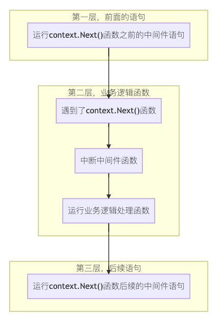

# Gin 中间件

中间件 middleware 在 Golang 中是一个很重要的概念，与 Java 中的拦截器类似，常用于提高应用程序的扩展能力，留出更多的扩展空间，比如：日志记录、故障处理等功能。

在 Gin 的整个实现中，中间件是 Gin 的精髓。一个个中间件组成了一条中间件链，对 HTTP Request 请求进行拦截处理，实现了代码的解耦和分离，并且中间件之间相互无感知，每个中间件只需要处理自己需要处理的事情即可。

## Gin 中间件概述

在最初的示例中，我们是直接通过 `gin.Default()` 来初始化 gin 对象,其中它包含了一个自带默认中间件的 `*Engine`。

其中，Default() 函数会默认绑定两个已经准备好的中间件，它们就是 Logger 和 Recovery，帮助我们打印日志输出和 painc 处理。

```go
// Default returns an Engine instance with the Logger and Recovery middleware already attached.
func Default() *Engine {
	debugPrintWARNINGDefault()
	engine := New()
	engine.Use(Logger(), Recovery())
	return engine
}
```

从上面 Default()函数中，我们可以看到 Gin 中间件是通过 Use 方法设置的，它是一个可变参数，可同时设置多个中间件。

```go
// Use attaches a global middleware to the router. ie. the middleware attached though Use() will be
// included in the handlers chain for every single request. Even 404, 405, static files...
// For example, this is the right place for a logger or error management middleware.
func (engine *Engine) Use(middleware ...HandlerFunc) IRoutes {
	engine.RouterGroup.Use(middleware...)
	engine.rebuild404Handlers()
	engine.rebuild405Handlers()
	return engine
}
```

看到这里，很容易理解到，Gin 的中间件实际上就是 Gin 定义的一个函数 func，该 func 的返回值类型为 `HandlerFunc`。

## 中间件实现

中间件主要用于完成一些通用的功能，便于功能的扩充、统一实现，类似于 filter。

从上面的介绍中，要实现一个中间件，只需满足以下两点：

- 它是一个函数
- 函数返回值的类型必须是 `HandlerFunc`

[示例](https://github.com/xcbeyond/golangLearning/tree/main/framework/gin-demo/midleware/main.go)：

实现计算每次请求执行花费的时间。

```go
package main

import (
	"fmt"
	"time"

	"github.com/gin-gonic/gin"
)

func main() {
	// 初始化gin对象
	route := gin.Default()

	// 中间件注册
	route.Use(costTimeMiddleware())

	// 设置一个get请求，其URL为/hello，并实现简单的响应
	route.GET("/hello", func(c *gin.Context) {
		c.JSON(200, gin.H{
			"message": "hello world!",
		})
	})

	// 启动服务
	route.Run()
}

func costTimeMiddleware() gin.HandlerFunc {
	return func(c *gin.Context) {
		// 请求前获取当前时间
		nowTime := time.Now()

		// 请求处理
		c.Next()

		// 请求处理完获取花费的时间
		costTime := time.Since(nowTime)

		requestURL := c.Request.URL.String()
		fmt.Printf("the request URL %s cost %v\n", requestURL, costTime)
	}
}

```

其中，c.Next() 只允许在中间件函数中使用，用于挂起请求业务逻辑处理。为了更好的理解中间件函数的执行，可以将中间件函数分为三层：



根据中间件注册的位置不同，分为：

- **全局中间件**：所有请求都经过该中间件。例如，上述示例中就属于全局中间件。
- **局部中间件**：只针对注册的路由生效。如果将中间件 `costTimeMiddleware` 注册在如下位置，则属于局部中间件，只对请求 /hello 生效。

  ```go
  route.GET("/hello", costTimeMiddleware(), func(c *gin.Context) {
  	c.JSON(200, gin.H{
  		"message": "hello world!",
  	})
  })

  ```

## 常见中间件

可参考：[contrib](https://github.com/gin-gonic/contrib)，里面包含众多常用的中间件。
