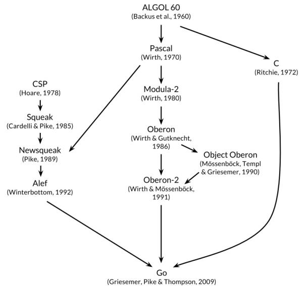

# Go语言介绍

## 1、Go语言介绍

> Go is an open source programming language that makes it easy to build **simple**, **reliable**, and **efficient** software.

“Go 是一种开源的程序设计语言，它意在使得人们能够方便地构建简单、可靠、高效的软件。”（来自Go 官网[golang.org](https://golang.org/)的定义）

Go 语言，又称为 Golang，在 2007 年 9 月形成构思，并于 2009 年 11 月发布，其发明人是 Google 的 Robert Griesemer, Rob Pike 和 Ken Thompson。该语言其及配套工具集使得编译和执行既富有表达力又高效，而且使得程序员能够轻松写出可靠、健壮的程序。

Go 的吉祥物是金花鼠（gordon），并将其作为 logo，如下图所示：


Go 是从 2007 年末由 Robert Griesemer, Rob Pike, Ken Thompson 主持开发，后来还加入了 Ian Lance Taylor, Russ Cox 等人，并最终于 2009 年 11 月开源，在 2012 年早些时候发布了 Go 1 稳定版本。现在 Go 的开发已经是完全开放的，并且拥有一个活跃的社区。

### 1.1 Go 的起源

编程语言的演化跟生物物种的演化类似，成功的语言会繁衍后代，这些后代语言会从它们的祖先那里汲取各种优点。有时候，语言间的“混血”会产生异常强大的力量；在一些罕见情况下，某个重大的语言特性也可能凭空出现而无先例。通过观察语言间的影响，我们可以学到不少知识，比如语言为什么会变成这个样子，以及它适合用于哪些环境等等。

下图展示了有哪些早期的编程语言对 Go 语言的设计产生了重要影响。



Go 有时会称为“类 C 语言”，或者是“21 世纪的 C 语言”。从 C 中，Go 继承了相似的表达式语法、控制流结构、基本数据类型、按值调用的形参传递和指针，但比这些更重要的是，继承了C所强调的要点：程序要编译成高效的机器码，并自然地与所处的操作系统提供的抽象机制相配合。

但是在 Go 语言的家族树中还有其它的祖先。其中一个有影响力的分支来自[Niklaus Wirth](https://en.wikipedia.org/wiki/Niklaus_Wirth)所设计的[Pascal](https://en.wikipedia.org/wiki/Pascal)语言。然后[Modula-2](https://en.wikipedia.org/wiki/Modula-2)语言激发了包的概念。然后[Oberon](https://en.wikipedia.org/wiki/Oberon)语言摒弃了模块接口文件和模块实现文件之间的区别。第二代的[Oberon-2](https://en.wikipedia.org/wiki/Oberon-2)语言直接影响了包的导入和声明的语法，还有 Oberon 语言的面向对象特性所提供的方法的声明语法等。

Go 语言的另一支祖先，带来了 Go 语言区别其他语言的重要特性，灵感来自于贝尔实验室的[Tony Hoare](https://en.wikipedia.org/wiki/Tony_Hoare)于1978年发表的鲜为外界所知的关于并发研究的基础文献 *顺序通信进程* （ *[communicating sequential processes](https://en.wikipedia.org/wiki/Communicating_sequential_processes)* ，缩写为[CSP](https://en.wikipedia.org/wiki/Communicating_sequential_processes)。在[CSP](https://en.wikipedia.org/wiki/Communicating_sequential_processes)中，程序是一组中间没有共享状态的平行运行的处理过程，它们之间使用管道进行通信和控制同步。不过[Tony Hoare](https://en.wikipedia.org/wiki/Tony_Hoare)的[CSP](https://en.wikipedia.org/wiki/Communicating_sequential_processes)只是一个用于描述并发性基本概念的描述语言，并不是一个可以编写可执行程序的通用编程语言。

接下来，Rob Pike 和其他人开始不断尝试将[CSP](https://en.wikipedia.org/wiki/Communicating_sequential_processes)引入实际的编程语言中。他们第一次尝试引入[CSP](https://en.wikipedia.org/wiki/Communicating_sequential_processes)特性的编程语言叫[Squeak](http://doc.cat-v.org/bell_labs/squeak/)（老鼠间交流的语言），是一个提供鼠标和键盘事件处理的编程语言，它的管道是静态创建的。然后是改进版的[Newsqueak](http://doc.cat-v.org/bell_labs/squeak/)语言，提供了类似 C 语言语句和表达式的语法和类似[Pascal](https://en.wikipedia.org/wiki/Pascal)语言的推导语法。Newsqueak 是一个带垃圾回收的纯函数式语言，它再次针对键盘、鼠标和窗口事件管理。但是在 Newsqueak 语言中管道是动态创建的，属于第一类值, 可以保存到变量中。

在 Plan9 操作系统中，这些优秀的想法被吸收到了一个叫[Alef](http://doc.cat-v.org/plan_9/2nd_edition/papers/alef/)的编程语言中。Alef试图将Newsqueak语言改造为系统编程语言，但是因为缺少垃圾回收机制而导致并发编程很痛苦。（译注：在 Alef 之后还有一个叫[Limbo](http://doc.cat-v.org/inferno/4th_edition/limbo_language/)的编程语言，Go 语言从其中借鉴了很多特性。 具体请参考 Pike 的讲稿：<http://talks.golang.org/2012/concurrency.slide#9> ）

Go 语言的其他的一些特性零散地来自于其他一些编程语言；比如 iota 语法是从[APL](https://en.wikipedia.org/wiki/APL_(programming_language))语言借鉴，词法作用域与嵌套函数来自于[Scheme](https://en.wikipedia.org/wiki/Scheme_(programming_language))语言（和其他很多语言）。当然，我们也可以从 Go 中发现很多创新的设计。比如 Go 语言的切片为动态数组提供了有效的随机存取的性能，这可能会让人联想到链表的底层的共享机制。还有 Go 语言新发明的 defer 语句。

### 1.2 Go 的特点

- 简洁、快速、安全
- 并行、有趣、开源
- 内存管理、数组安全、编译迅速

### 1.3 Go 的用途

其它语言能够实现的系统，Go 语言都能实现。

目前，Go 主要应用在下面这些系统：

- 服务器编程，以前你如果使用 C 或者 C++ 做的那些事情，用 Go 来做很合适，例如处理日志、数据打包、虚拟机处理、文件系统等。

- 分布式系统、数据库代理器等，比如 Etcd。

- 网络编程，这一块目前应用最广，包括 Web 应用、API 应用、下载应用，而且 Go 内置的 `net/http` 包基本上把我们平常用到的网络功能都实现了。

- 数据库，前一段时间 Google 开发的 Groupcache，Couchbase 的部分组件，Tidb，Cockroachdb，Influxdb 等。

- 云平台，目前国外很多云平台在采用Go开发，CloudFoundy的部分组建，前VMare的技术总监自己出来搞的Apcera云平台。
- 云原生技术，比如docker、Kubernetes等。

### 1.4 Go 的美貌

说了这么多，Go 程序到底长啥样？我们先睹为快，一看美貌！

来来来，以 `hello.go` 为例看看它长啥样。（Go 语言源文件的扩展是 `.go`）

```go
package main

import "fmt"

func main() {
    fmt.Println("Hello, World!")
}
```

## 2、为什么我们要学习Go？

就我而言，目前主要从事微服务方面的产品研发，之前一直使用Java语言作为核心编程语言，但随着市场的变化，Java有时变得力不从心（一些轻量级的功能模块实现时，Java却显得有些笨重）。此外，为迎接云原生技术的到来，学习Go成为了必然。

对于你而言，为什么要学习Go呢？下面我参考知乎和网上大神的答案，谈谈Go语言的优势。

- **Go 语言特色**

  - 简洁、快速、安全
  - 并行、有趣、开源
  - 内存管理、数组安全、编译迅速
  
- **Go 语言用途**
  
  Go 语言被设计成一门应用于搭载 Web 服务器，存储集群或类似用途的巨型中央服务器的系统编程语言。
  
  对于**高性能分布式系统**领域而言，Go 语言无疑比大多数其它语言有着更高的开发效率。它提供了海量并行的支持，这对于游戏服务端的开发而言是再好不过了。
  
- **C/C++ 的问题**
  
  开发效率低，对开发者要求高；libc 只向后兼容，运维难度偏大。

- **Lua/Python 的问题**
  
  动态语言，缺少编译过程，低级错误频出；缺少有效的性能分析及调试工具。
