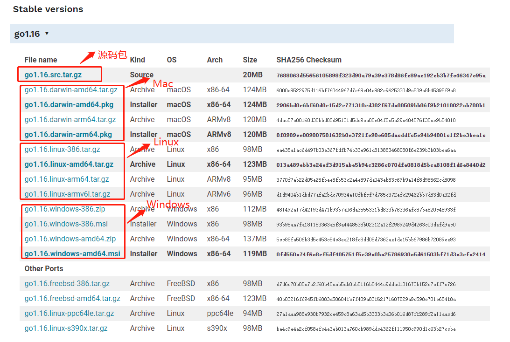
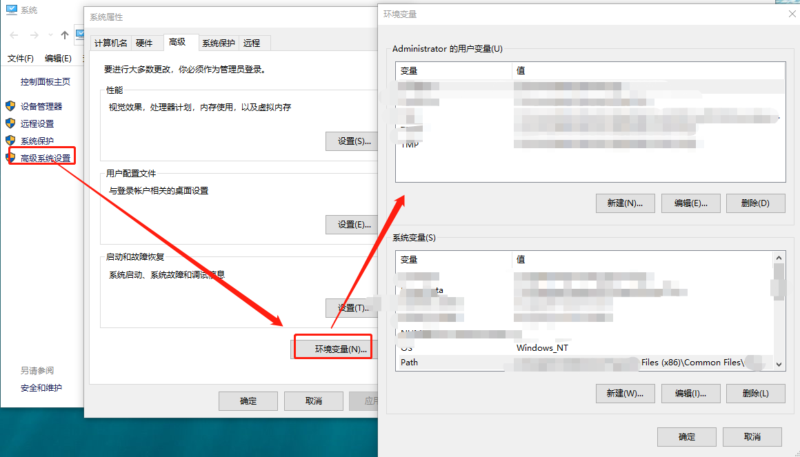
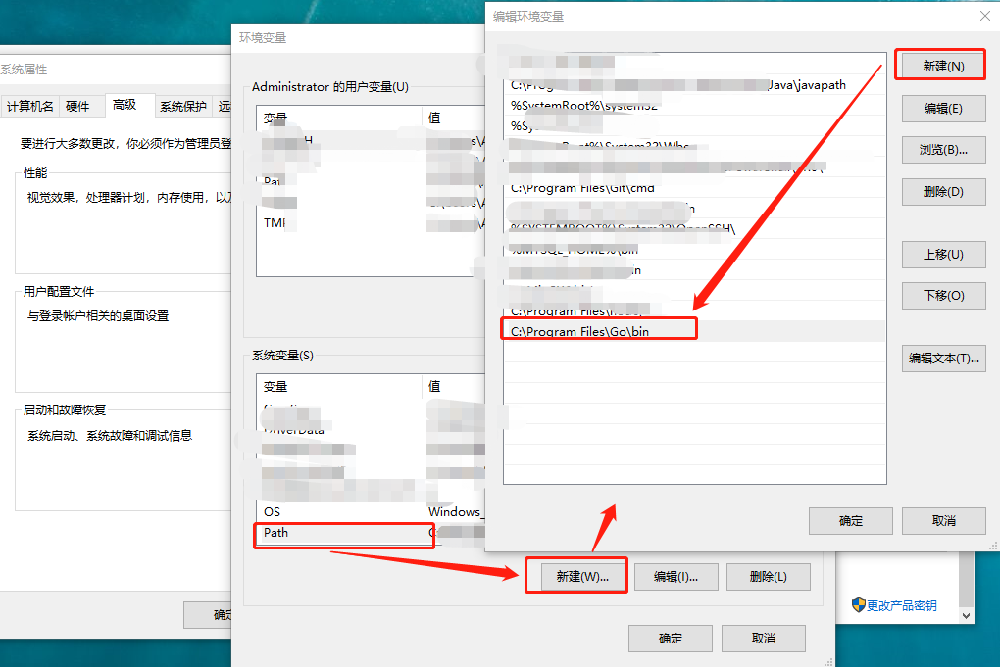
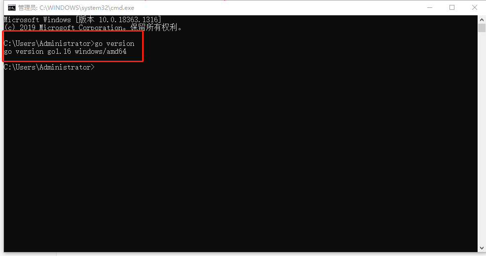
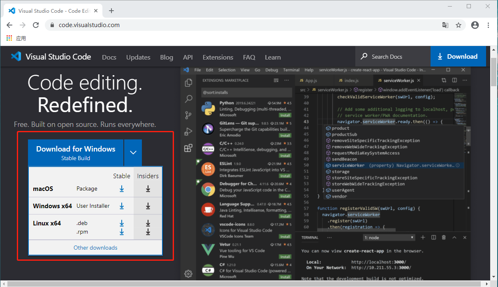
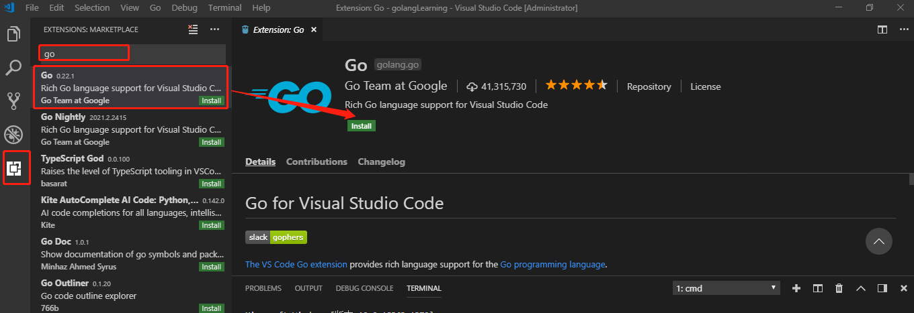
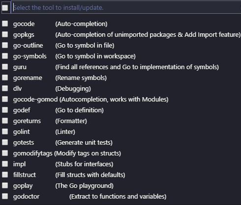
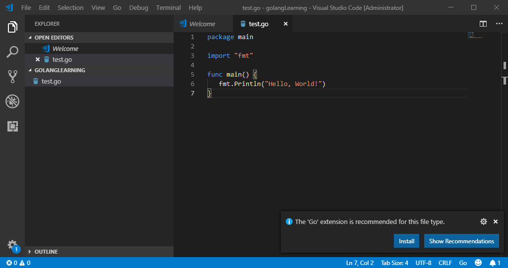

# 开发环境搭建

## 1、Go语言环境安装

### 1.1 开发包获取

Go 语言支持以下系统：

* Windows
* Linux
* Mac：也称为 Darwin
* [FreeBSD](https://baike.baidu.com/item/FreeBSD)

开发包下载地址为：[https://golang.org/dl](https://golang.org/dl)

如果打不开可以使用这个地址：[https://golang.google.cn/dl](https://golang.google.cn/dl)

根据你的系统，选择下载对应的开发包。



以 Windows 系统为例，下载 Windows 的安装包 `go1.16.windows-amd64.msi`，下载地址：[https://golang.google.cn/doc/install?download=go1.16.windows-amd64.msi](https://golang.google.cn/doc/install?download=go1.16.windows-amd64.msi)

### 1.2 开发包安装

（1）安装开发包。

双击下载的安装包 `go1.16.windows-amd64.msi`，一步步安装即可。

默认情况下，会安装在 `C:\Program Files\Go` 目录下。（不同版本会存在差异，以实际为准！）

（2）配置 Go 环境变量。

> 默认情况下，安装完开发包会自动配置 Go 环境变量，如若未配置或配置不符合自己需求（GOPATH 可按照自己的实际情况配置），则安装下面的配置方法配置或进行调整。

根据 Windows 系统在查找可执行程序的原理，可以将 Go 所在路径定义到环境变量中，让系统帮我们去找到运行执行的程序，这样任何目录都可以执行 go 指令。配置的环境变量如下所示：

| 环境变量 | 说明 |
| -------- | ---- |
| Path | 添加 Go 开发包的 /bin 目录，如：`C:\Program Files\Go\bin` |
| GOPATH | 工作目录，设置 Go 项目的工作路径，可根据自我喜好设置。 |

右键“我的电脑”-> 属性 -> 高级系统设置 -> 高级 -> 系统变量：



添加的环境变量如下：

* Path：`C:\Program Files\Go\bin`



* GOPATH：`E:\github\golangLearning`，自定义目录，作为后续 Go 工程目录。

（3）环境检验。

打开 cmd 命令行，执行 `go version`，检查是否安装成功并生效。



## 2、IDE 安装

### 2.1 IDE 工具

常用的 Go 开发 IDE 如下所示：

* **Visual Studio Code（简称 VSCode）**

  微软的产品，一个运行于 Mac OS、Windows 和 Linux 之上的工具，默认提供 Go 语言的语法高亮。安装 Go 语言插件，还可以支持智能提示，编译运行等功能。

* **Sublime Text**
  
  可以免费试用，默认也支持Go代码语法高亮，只是保存次数达到一定数量后需要购买。

* **Vim**
  
  它是从 vi（Linux）发展出来的一个文本编辑器，代码补全、编译及错误跳转等方便编程的功能非常丰富。

* **Emacs**
  
  它不仅仅是一个编辑器，因为功能强大，可称为集成开发环境。

* **Eclipse IDE 工具**
  
  开源免费，并提供 GoEclipse 插件。

* **LiteIDE**
  
  LiteIDE 是一款专门为 Go 语言开发的跨平台轻量级集成开发环境（IDE），是国人开发的。

* **JetBrains公司的产品**
  
  GoLand、PhpStrom、WebStrom 和 PyCharm 等 IDE 工具，都需要安装 Go 插件。

Go 语言的 IDE 工具很多，可根据自我喜好自行选择，不做强制要求。

（建议大家先选择使用 VSCode，这样能让你更好地理解 Go 语言、基本语法和关键字等。等熟悉 Go 的语法后，再切换到自己顺手的 IDE 即可。）

### 2.2 安装 VSCode

下载地址：[https://code.visualstudio.com/](https://code.visualstudio.com/)



下载页面可以选择不同版本供大家下载。

我选择了 `Windows x64` 版本下载，并直接安装即可。

### 2.3 VSCode 配置 Go 语言插件

（1）首先安装 Go 语言插件：



（2）配置 Go 开发环境包

VSCode 中，快捷键 `ctrl+shift+p` 打开，输入 `go:install`：


并选中 `Go:Install/Update Tools` 回车，并全部勾选，确认：



```sh
Tools environment: GOPATH=E:\github\golangLearning
Installing 9 tools at E:\github\golangLearning\bin in module mode.
  gopkgs
  go-outline
  gotests
  gomodifytags
  impl
  goplay
  dlv
  golint
  gopls
  省略……

Installing github.com/uudashr/gopkgs/v2/cmd/gopkgs (E:\github\golangLearning\bin\gopkgs.exe) SUCCEEDED
Installing github.com/ramya-rao-a/go-outline (E:\github\golangLearning\bin\go-outline.exe) SUCCEEDED
省略……

All tools successfully installed. You are ready to Go :).
```

### 2.4 Go 语言程序快速运行

（1）VSCode 打开刚刚创建的 GOPATH 工程目录。

（2）创建一个新的文件 `test.go`，编写 `Hello, World!` Go 程序，代码如下：

```go
package main

import "fmt"

func main() {
   fmt.Println("Hello, World!")
}
```

保存文件后，VSCode 会自动检测到可能需要安装的扩展包或插件，此时我们会看到右下角有弹框提示，如下所示。此时我们暂时忽略，无需安装。



（3）快速运行。

VSCode 中 “Terminal” -> New Terminal，执行 `go run test.go` 命令直接运行 test.go 程序，结果如下：

（实际环境是需要先编译(`go build`)后运行。`go run` 命令的执行时间较长，是因为其中包含编译过程。）


到此，Go 语言开发环境搭建完毕！
