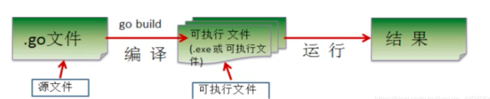
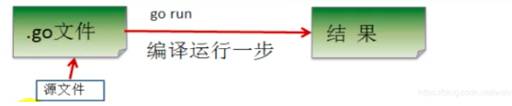

# 编写第一个Go程序

在开始 Go 语言的基本语法、函数和高级特性等之前，让我们先编写第一个 Go 程序 “Hello World” 开始，来了解 Go 语言最简单程序的结构吧，看看 Go 程序应该包括哪些部分，每部分都位于什么位置，Go 语言究竟是如何执行的。

我们依然从永恒的 “hello,world” 程序开始，`hello.go` 源代码如下：

```go
package main

import "fmt"

func main() {
    // "Hello World!" Go语言程序
    fmt.Println("Hello World!")
}
```

让我们来看下以上程序的各个部分：

* 第一行代码 `package main` 定义了包名。你必须在源文件中非注释的第一行指明这个文件属于哪个包，如：`package main`。
* `package main` 表示一个可独立执行的程序，每个 Go 应用程序都包含一个名为 main 的包。
* 下一行 `import fmt` 告诉 Go 编译器这个程序需要使用 `fmt` 包中的函数或其他元素，`fmt` 包实现了格式化 IO（输入/输出）的函数。
* 下一行 `func main()` 是程序开始执行的函数（入口函数）。`main` 函数是每一个可执行程序所必须包含的，一般来说都是在启动后第一个执行的函数（如果有 init\(\) 函数则会先执行该函数），等同于 Java 中的 `public static void main(String[] agrs)`。
* 下一行 `//` 是注释，在程序执行时将被忽略。单行注释是最常见的注释形式，你可以在任何地方使用以 `//` 开头的单行注释。多行注释也叫块注释，均已以 `/*` 开头，并以 `*/` 结尾，且不可以嵌套使用，多行注释一般用于包的文档描述或注释成块的代码片段。（与其他语言相同）
* 下一行 `fmt.Println(...)` 可以将字符串输出到控制台，并在最后自动增加换行字符 `\n` 换行。使用 `fmt.Print("hello, world\n")` 可以得到相同的结果。`Print` 和 `Println` 这两个函数也支持使用变量，如：`fmt.Println(arr)`。如果没有特别指定，它们会以默认的打印格式将变量 arr 输出到控制台，后续会单独讲解 `fmt` 包相关的内容。

## 1、Go语言结构

从上面的 hello world 程序可以看出，一个完整 Go 语言的程序结构由以下几部分组成：

* 包声明
* 引入包
* 函数
* 变量
* 语句 & 表达式
* 注释

## 2、执行流程

Go程序源文件是以 `.go` 作为后缀的文件，有两种执行流程：

1、将源文件先编译成可执行的二进制文件，再运行。

* 编译源代码：`go build <xx.go>` 命令，生成可执行文件。
* 运行可执行文件：直接运行可执行程序文件。

常用于在 Go 编译环境上编译生成可执行的二进制文件，并将可执行的二进制文件部署在任何没有 Go 编译环境的机器上。



2、直接对源文件执行 `go run <xx.go>` 命令。

常用于开发环境测试使用。（`go run` 必须依赖 go 开发编译环境）



## 3、开发注意事项

* Go 源文件以 “go” 为扩展名，如：`hello.go`。
* Go 应用程序的执行入口是 `main()` 函数。
* Go 语言严格区分大小写。
* Go 方法是由一条条语句构成，每个语句后不需要分号 `;` 结束（实际上 Go 语言会自动在每行后加分号），这也体现了 Go 语言的简洁性。
* Go 编译器是一行行编译的，因此我们一行就写一条语句，不能把多条语句写在同一行，否则报错。
* Go 语言定义变量或者 `import` 的包如果没有使用到，则代码不能编译通过。
* 大括号都是成对出现的。
* 大括号 `{` 不能单独放在一行。如：

  ```go
  package main

  import "fmt"

  func main() 
  { // 错误，{不能单独成行
      fmt.Println("Hello World!")
  }
  ```

* Go 语言有内置 `gofmt` 工具，能够自动整理代码多余的空白、变量名称对齐、并将对齐空格转换成 Tab。

