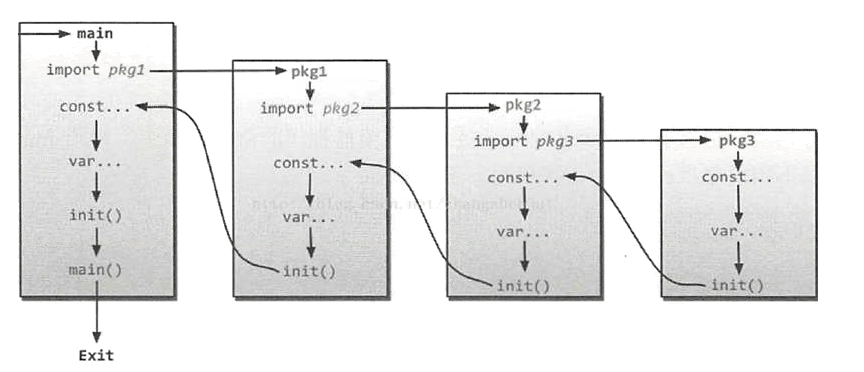

# 包的介绍和使用

Go 语言像 Java 语言一样都拥有包的概念，通过使用包来组织源代码。包（`package`）是多个 Go 源码的集合，是一种高级的代码复用方案。Go语言中为我们提供了很多内置包，如 `fmt`、`os`、`io` 等。

任何 Go 源代码文件都必属于某个包，同时源码文件的第一行有效代码必须是 `package pacakgeName` 语句，通过该语句声明自己所在的包。

## 1、包的概述

Go 语言的包借助了目录树的组织形式，一般包的名称就是其源文件所在目录的名称，虽然 Go 语言没有强制要求包名必须和其所在的目录名同名，但还是建议包名和所在目录同名，这样代码结构会更加清晰。

### 1.1 包的定义

包的声明如下：

```go
package <package_name>
```

注意：包声明必须在 go 源文件的第一行定义。

例如，在 `GOPATH/src/a/b/` 下定义包 `c`，则在 `GOPATH/src/a/b/` 目录下的所有 go 源文件第一行需要声明 `package c`，而不是声明为 `package a.b.c` 或 `package a/b/c`，但在导入包时，需要带上路径 `import a/b/c`。（**注意：这与 Java 语言中包的用法差异很大**）

### 1.2 包的命名规范

清晰的代码结构，少不了规范命名，包的命名更为重要。规范命名的目的是为了让你的代码更清晰，别人读起来更快上手。包命名规范推荐如下：

* 包名一般小写，使用一个简短且有意义的单词或缩写。
* 包名与所在包的目录同名，看目录知包名。
* 包名一般采用域名作为包目录结构，以此来确保唯一性。如：`GOPATH/src/github.com/xcbeyond/projectName/...`。
* 程序入口包名必须是 `main` 包。
* 同一目录下的所有 go 源文件都属于同一个包。

## 2、包的使用

有了包的存在，必然少不了对其导入，可借助 `import` 关键字导入想使用的包。具体语法如下：

```go
import "包路径"
```

注意：

* `import` 导入语句需放在源码文件开头的包声明语句的下面。
* 导入的包名需要使用双引号 `""` 括起来。
* 包名是从 `GOPATH/src/` 后开始计算的，使用 `/ ` 进行路径分隔。

通常导入包有单行导入和多行导入两种方式。

**单行导入：**

```go
import "包1路径"
import "包2路径"
```

**多行导入：**

```go
import (
    "包1路径"
    "包2路径"
)
```

### 2.1 导入路径

关于包的导入路径有两种方式，分别是全路径导入和相对路径导入。

**全路径导入：**

包的绝对路径就是 `GOROOT/src/` 或 `GOPATH/src/` 后面包的存放路径，如下所示：

```go
import "lab/test"
import "database/sql/driver"
import "database/sql"
```

其中：

* `test` 包是自定义的包，其源码位于 `GOPATH/src/lab/test` 目录下。
* `driver` 包的源码位于 `GOROOT/src/database/sql/driver` 目录下。
* `sql` 包的源码位于 `GOROOT/src/database/sql` 目录下。

**相对路径导入**：

相对路径只能用于导入 `GOPATH` 下的包，标准包的导入只能使用全路径导入。

例如，包 `a` 的所在路径是 `GOPATH/src/lab/a`，包 `b` 的所在路径为 `GOPATH/src/lab/b`，如果在包 `b` 中导入包 `a` ，则可以使用相对路径导入方式。示例如下：

```go
// 相对路径导入
import "../a"
```

### 2.2 包的引用

包的引用有四种格式，下面以 `fmt` 包为例分别进行说明。

#### 2.2.1 标准引用格式

```go
import "fmt"
```

用 `fmt.` 作为前缀来使用 `fmt` 包中的方法，这是最为常用的一种方式。

示例如下：

```go
package main
   
import "fmt"
   
func main() {
    fmt.Println("Hello World!")
}
```

#### 2.2.2 自定义别名引用格式

在导入包的时候，我们可以为导入的包设置别名，简化使用：

```go
import F "fmt"
```

其中 `F` 就是 `fmt` 包的别名，可以用 `F.`来代替标准引用格式的 `fmt.` 来作为前缀使用 `fmt` 包中的方法。

示例如下：

```go
package main
   
import F "fmt"
   
func main() {
   F.Println("Hello World!")
}
```

#### 2.2.3 省略引用格式

```go
import . "fmt"
```

相当于把 `fmt` 包直接合并到当前源文件中，在使用 `fmt` 包内的方法是可以不用加前缀 `fmt.`而直接引用。

示例如下：

```go
package main
   
import . "fmt"
   
func main() {
    Println("Hello World!")
}
```

#### 2.2.4 匿名引用格式

在引用某个包时，如果只是希望执行包初始化的 `init` 函数，而不使用包内部的数据时，可以使用匿名引用格式：

```go
import _ "fmt"
```

使用标准格式引用包，但代码中却没有使用包，编译器是会报错。如果包中有 `init` 初始化函数，则通过`import _ "包的路径"` 这种方式引用包，仅执行包的初始化函数，即使包没有 `init` 初始化函数，也不会引发编译器报错。

示例如下：

```go
package main
   
import (
    _ "database/sql"
    "fmt"
)
   
func main() {
    Println("Hello World!")
}
```

### 2.3 包的初始化

通过前面的学习相信大家已经大体了解了 Go 程序的启动和加载过程，在执行 `main` 包的 `main` 函数之前， Go 引导程序会先对整个程序的包进行初始化。整个执行的流程如下图所示：



Go语言包的初始化有如下特点：

* 包初始化程序从 `main` 函数引用的包开始，逐级查找包的引用，直到找到没有引用其他包的包，最终生成一个包引用的有向无环图。
* Go 编译器会将有向无环图转换为一棵树，然后从树的叶子节点开始逐层向上对包进行初始化。
* 单个包的初始化过程如上图所示，先初始化常量，然后是全局变量，最后执行包的 `init` 函数。